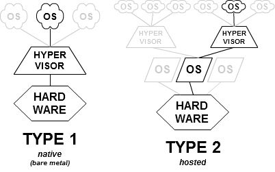

# 和虚拟化相关的基本概念

## 所以虚拟化是个啥玩意？

> 在计算机技术中，虚拟化（技术）或虚拟技术（英语：Virtualization）是一种资源管理技术，是将计算机的各种实体资源（CPU、内存、磁盘空间、网络适配器等），予以抽象、转换后呈现出来并可供分区、组合为一个或多个电脑配置环境。由此，打破实体结构间的不可切割的障碍，使用户可以比原本的配置更好的方式来应用这些电脑硬件资源。这些资源的新虚拟部分是不受现有资源的架设方式，地域或物理配置所限制。一般所指的虚拟化资源包括计算能力和数据存储。
>
> --- [https://zh.wikipedia.org/wiki/虚拟化](https://zh.wikipedia.org/wiki/虚拟化)

简单说的话，虚拟化就是在现有硬件上虚拟出一个和现有硬件类似（或者有差别）的硬件让某个应用或操作系统运行。不过应用或系统会把虚拟出来的硬件当作完整的硬件配置，看不到外面的真实配置。一个现实环境的几个虚拟环境之间也能做到相互隔离。

## 那虚拟机又是啥？

简单地说，虚拟机本身还是一种软件。它用来生成一个虚拟的环境，然后在生成的虚拟的环境里执行一些操作。

* 有一些编程语言会利用虚拟机来执行代码，例如 Java 中的 JVM、 Python 中的 PVM 等等。这种虚拟机被称作“软件虚拟机”或者“进程虚拟机”
* 当然大家听到虚拟机的时候，更多的时候指的是用来虚拟一整台电脑的那种“操作系统虚拟机”啦，这篇教程（？）主要介绍的也是这种。
* 特别地，有些用来虚拟某些特定平台（例如虚拟古老硬件）的虚拟机软件偶尔也会被称作“模拟器”。（虽然有些模拟器的原理并不是完全的虚拟一个环境出来……）

目前的习惯是把虚拟机软件（Hypervisor）分成两类：

* Type 1（有时也叫做 Bare Metal），这种虚拟机直接运行在硬件上，通常会和运行软件的操作系统一起安装在主机上。
* Type 2 （有时也叫做 Hosted），这种虚拟机通常是一个独立的软件，安装在一个已有的操作系统上（经常被称作 Host OS）。

直接来看的话， Type 1 类型的虚拟机少了一层操作系统，性能会比 Type 2 类型的稍微好一些，算是对安装和配置比 Type 2 类型的更繁琐复杂的回报吧……

## 所以怎么区分主机和虚拟机里的系统？

通常咱们都用 Host / Guest 来区分主机或虚拟机里的系统。

### **Host OS（宿主/真实系统）**

虚拟机也是一种软件啦，当然它需要安装在一个操作系统上，安装虚拟机软件的操作系统就被称作“Host OS”。对于 Type 1 类型的虚拟机而言，安装虚拟机软件通常就和安装 Host OS 一起进行了。

### **Guest OS（访客/来宾/虚拟系统）**

运行在虚拟机软件内部的操作系统，就称为“Guest OS”啦。

## 全虚拟化和硬件协助虚拟化又是啥咧？

这大概要从[波佩克与戈德堡虚拟化需求](https://en.wikipedia.org/wiki/Popek_and_Goldberg_virtualization_requirements)开始说起：

> * 等价性：一个运行于VMM下的程序，其行为应与直接运行于等价物理机上的同程序的行为完全一致。
> * 资源控制：VMM对虚拟资源进行完全控制。 
> * 效率性：机器指令中经常使用的那一部分应在没有VMM干预下执行。

最早的虚拟化都是由软件全权负责的，于是软件模拟的效率就成了说多了都是泪的典型……

后来随着虚拟化技术需求的增加，Intel 和 AMD 都在自家的 CPU 中加入了和虚拟化相关的指令集（Intel 称为 VT-x ，AMD 称作 AMD-V），流行的虚拟机软件也加入了对这两种指令集的支持。

有了硬件协助之后，就可以在一定程度上提高虚拟机的运行效率（Guest OS 请求执行的某些 CPU 特权指令可以直接交给硬件来运行，比软件模拟的效率高多了）。

不过介于硬件协助和架构密切相关，现在某些跨架构的虚拟（例如在 x86 上模拟早期苹果电脑 PowerPC 架构的虚拟机软件 PearPC）还是要靠全软件虚拟来完成。

再后来，人们又发现让虚拟机访问物理机的设备好麻烦（如果直接用直接内存访问（DMA）的方式访问硬件的话，硬件不知道给定虚拟机客户机物理地址与主机物理地址之间的映射关系，有可能搞坏内存里的数据。而由管理程序或主机操作系统介入I/O操作的话，虽然比较安全，但是延迟就增加了咧……）。

于是 Intel 和 AMD 又整出了个 “输入输出内存管理单元” （常用的缩写 IOMMU）的家伙，它通过将虚拟机的物理地址映射到物理机物理地址的相同或兼容转换表重映射硬件访问地址来解决延迟问题，一定程度上也能提供保护。甚至还能搞出一些神奇的操作（例如通过直通的方式让虚拟机直接使用物理机的硬件等等）。

