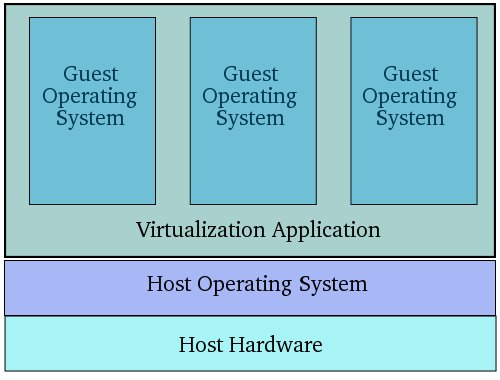

# 和虚拟化相关的基本概念

## 所以虚拟化是个啥玩意？

> 在计算机技术中，虚拟化（技术）或虚拟技术（英语：Virtualization）是一种资源管理技术，是将计算机的各种实体资源（CPU、内存、磁盘空间、网络适配器等），予以抽象、转换后呈现出来并可供分区、组合为一个或多个电脑配置环境。由此，打破实体结构间的不可切割的障碍，使用户可以比原本的配置更好的方式来应用这些电脑硬件资源。这些资源的新虚拟部分是不受现有资源的架设方式，地域或物理配置所限制。一般所指的虚拟化资源包括计算能力和数据存储。
>
> --- [https://zh.wikipedia.org/wiki/虚拟化](https://zh.wikipedia.org/wiki/虚拟化)

## 那虚拟机又是啥？

简单地说，虚拟机本身还是一种软件。它用来生成一个虚拟的环境，然后在生成的虚拟的环境里执行一些操作。

* 有一些编程语言会利用虚拟机来执行代码，例如 Java 中的 JVM、 Python 中的 PVM 等等。这种虚拟机被称作“软件虚拟机”或者“进程虚拟机”
* 当然大家听到虚拟机的时候，更多的时候指的是用来虚拟一整台电脑的那种“操作系统虚拟机”啦，这篇教程（？）主要介绍的也是这种。

目前的习惯是把虚拟机软件（Hypervisor）分成两类：

* Type 1（有时也叫做 Bare Metal），这种虚拟机直接运行在硬件上，通常会和运行软件的操作系统一起安装在主机上。
* Type 2 （有时也叫做 Hosted），这种虚拟机通常是一个独立的软件，安装在一个已有的操作系统上（经常被称作 Host OS）。

直接来看的话， Type 1 类型的虚拟机少了一层操作系统，性能会比 Type 2 类型的稍微好一些，算是对安装和配置比 Type 2 类型的更繁琐复杂的回报吧……

## 所以怎么区分主机和虚拟机里的系统？

通常咱们都用 Host / Guest 来区分主机或虚拟机里的系统。

### **Host OS（宿主/真实系统）**

虚拟机也是一种软件啦，当然它需要安装在一个操作系统上，安装虚拟机软件的操作系统就被称作“Host OS”。对于 Type 1 类型的虚拟机而言，安装虚拟机软件通常就和安装 Host OS 一起进行了。

### **Guest OS（访客/来宾/虚拟系统）**

运行在虚拟机软件内部的操作系统，就称为“Guest OS”啦。

## 全虚拟化和半虚拟化又是啥咧？

