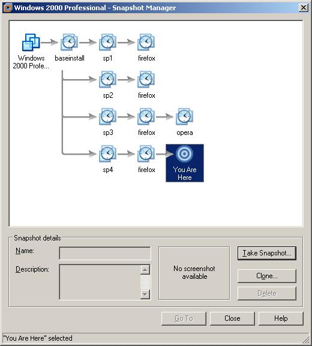

# 操作系统虚拟化软件的常见功能

## 所以一个~~成熟的~~虚拟机软件应该有什么功能？

> ~~你已经是个成熟的……~~

### 同时运行多个操作系统

这当然是虚拟机软件的基本功啦，只要汝的硬件能撑得住，就能运行足够多的虚拟系统。

### 快照功能

大多数虚拟机软件都有这个功能，有些人可能觉得这个上虚拟机软件必备的功能：

* 为某个虚拟系统创建快照的时候，虚拟机软件会把这个虚拟系统的所有信息（例如配置，内存和硬盘的状态等等）都保存在汝物理机的硬盘上。
* 当需要的时候，可以再切换到这个快照（一般称作“恢复”或“还原”）。一旦切换到某个快照，虚拟系统（Guest OS）就回到当初创建快照的那个状态。
* 有些虚拟机软件支持在虚拟机关机或重新启动时自动还原至某个指定的快照，是不是像极了某些公共场所里的电脑的样子？ 
* 大多数虚拟机软件都支持树状结构的快照，也就是说，汝可以在某个快照之上再创建快照。也可以切换回之前的快照，再在之前的快照的基础上再创建快照。

### 虚拟同种或不同种 CPU

这个就很好理解啦，大多数虚拟机软件都只能虚拟和物理机相同（型号或架构）的 CPU。但有些可以虚拟不同种类型的 CPU （例如大多数模拟器）。

### 虚拟内存和硬盘

这个也很好理解啦，汝可以在虚拟机软件中为虚拟机设置内存和硬盘大小，虚拟机只会用到虚拟机软件分给它的那一部分（剩下的它也不知道有）。

### 虚拟网络

为了能让虚拟机能够访问网络，虚拟网卡出来当然是必不可少的啦，为了应对各种复杂的情况，大多数的虚拟机软件也都支持不同的虚拟网卡模式。例如 VirtualBox 就支持：

* NAT 模式，这种模式最简单，通过网络地址转换（**N**etwork **A**ddress **T**ranslation，NAT 就是这么来的）来共享主机的网络连接。如果只是简单的想让虚拟机访问网络的话，用这个模式就没错。
* 桥接网卡（有时也称作 Bridge 模式），就是相当于汝虚拟机的虚拟网卡直接连到汝物理机连接的网络上去。如果汝想让汝物理网络上的设备也能访问到虚拟机的话，这个模式最简单。
* 仅主机（Host-Only 网络），望名生义啦，这个网络模式下只有主机和虚拟机之间能互相看到，适合干一些 OOXX 的事情（啥？）
* 内部网络（有时也称作 Internal），这个模式比仅主机网络再进一步，连主机上的进程也看不到虚拟网络，适合干一些更 OOXX 的事情（啥？？）

### 虚拟外设

最常见的就是光驱和 USB 啦……

* 虚拟光驱的话，除了把物理机上的光驱拿出来用以外（只要有的话），也可以把光盘映像文件给虚拟机塞过去……
* USB 的话，就像真的插在别的电脑上一样，会从汝的物理机上消失，然后出现在虚拟机里……

### 共享和迁移

大多数的虚拟机软件都支持把虚拟机文件导出成符合开放虚拟化格式的 OVF 或者 OVA 文件，汝可以把导出的文件分享给其他人来安装。

除了把虚拟机文件复制到其它电脑上这种常见的迁移操作以外，某些虚拟机软件还支持所谓的“热迁移”，就是在虚拟机运行时把它搬到另一台主机上啦。在汝需要维护主机（例如升级主机的软硬件或者排除故障）的时候可能会是有用的功能。

### 还有么？

其实还可以举的例子有很多啦，例如：

* 让虚拟机的软件直接显示在主机的桌面上（而不是虚拟显示器上）的“无缝模式”。
* 通过某些远程连接协议（例如 VNC 或者 RDP 等等）直接连接到虚拟机进行操作。
* 把物理机转换成虚拟机映像。
* 等等……

###  

