# 创建虚拟机

首先点击工具栏上的“新建”按钮打开新建虚拟电脑的对话框。

> 如果汝之前有建立过，文件还在但是不知道为啥在虚拟电脑管理器中找不到了的话，那个“注册”按钮可以加回来。

## 虚拟电脑名称和系统类型

字如其意，给虚拟机起个名字啦，以及选择里面的虚拟系统是啥。

> 这里的虚拟系统类型和版本最好和汝要安装的系统一致。这会影响后面的推荐设置和 Guest Additions 安装的步骤。

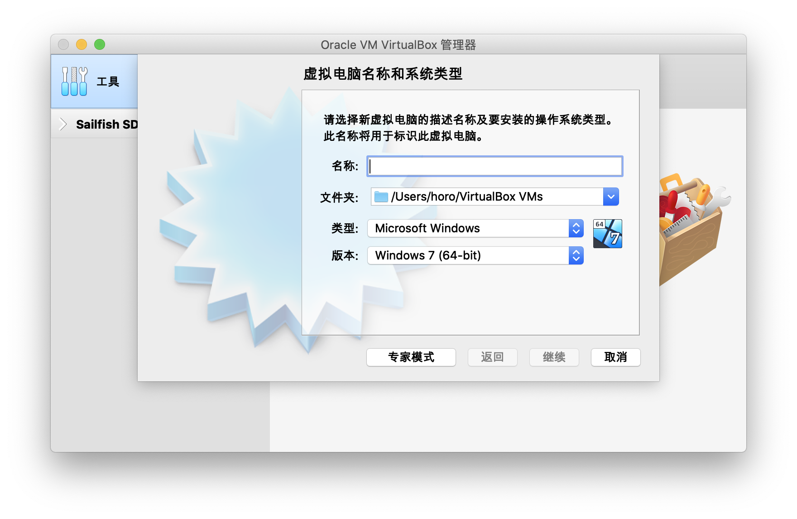

如果汝的习惯也是名称是虚拟系统的名称的话，汝可能会发现在输入名称的时候下面的类型和版本也变化了。

## 虚拟内存大小

为虚拟电脑选择合适的内存大小。

* 如果汝在上面选择了正确的系统的话，一开始的推荐设置其实大多数情况下都足够了。当然也是越多越好啦。
* 肯定不能比汝主机的内存大。以及最好给主机留一些内存（尽可能的不要超过下面图中橙色和红色的范围）。

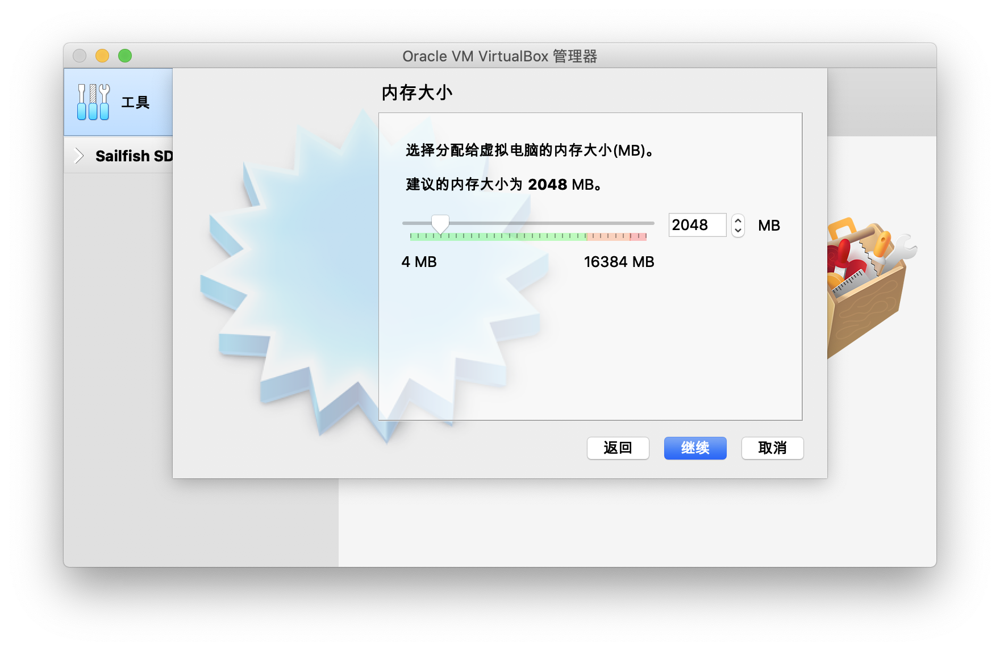

## 创建虚拟硬盘

因为这是第一台虚拟机，所以直接选择“现在创建虚拟硬盘”。

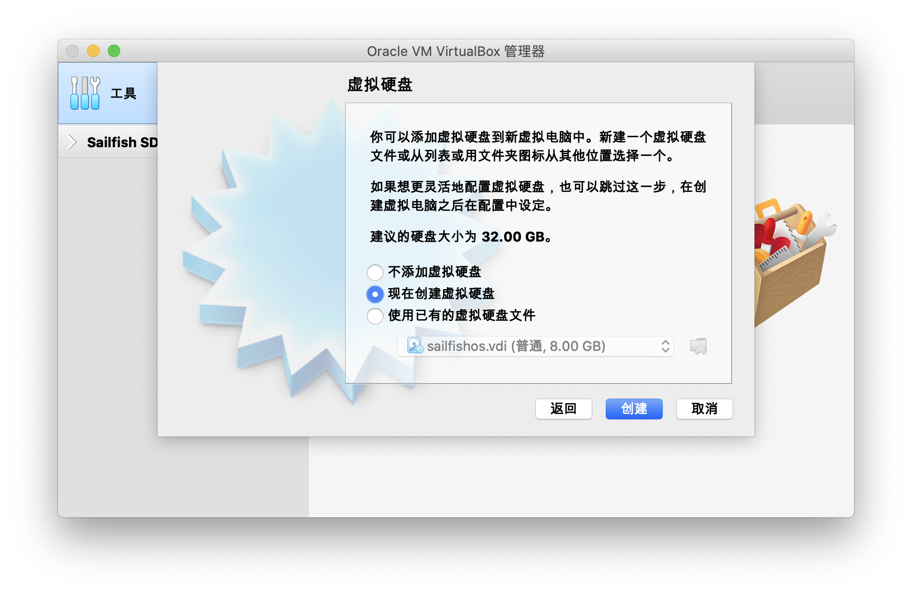

接下来就是选择一种格式啦：

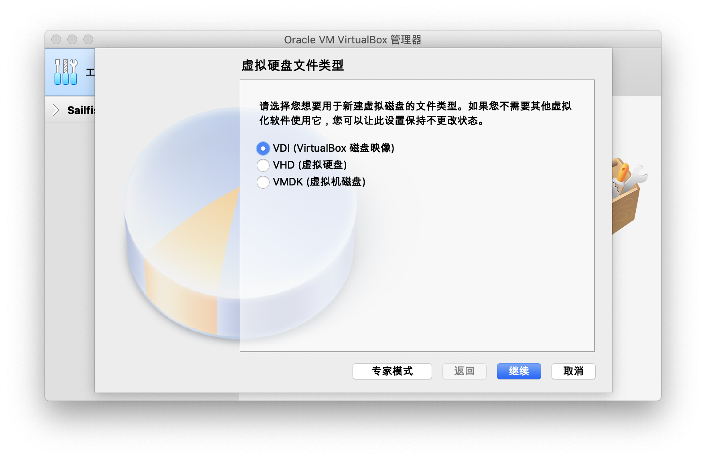

* VDI（VirtualBox 磁盘映像），是 VirtualBox 用的虚拟硬盘格式。
* VHD（虚拟硬盘），其实就是 Windows 的虚拟硬盘格式啦， 在 Windows Virtual PC 和 Hyper-V 里会用到。
* VMDK（虚拟机磁盘），其实就是另一个虚拟机软件 VMware 所使用的格式啦。

于是就按上面的意思走吧，如果汝之后没有换其它虚拟机软件的打算，就直接用 VDI 吧……

虚拟硬盘在汝真实的硬盘上其实就是一个文件啦，于是要如何分配空间呢？

* 动态分配的虚拟磁盘一开始会很小，会在使用的过程中逐渐增大到分配的大小。
* 固定大小的虚拟磁盘的文件大小一开始就是汝所设置的大小。

于是大多数情况下直接用动态分配就好啦……

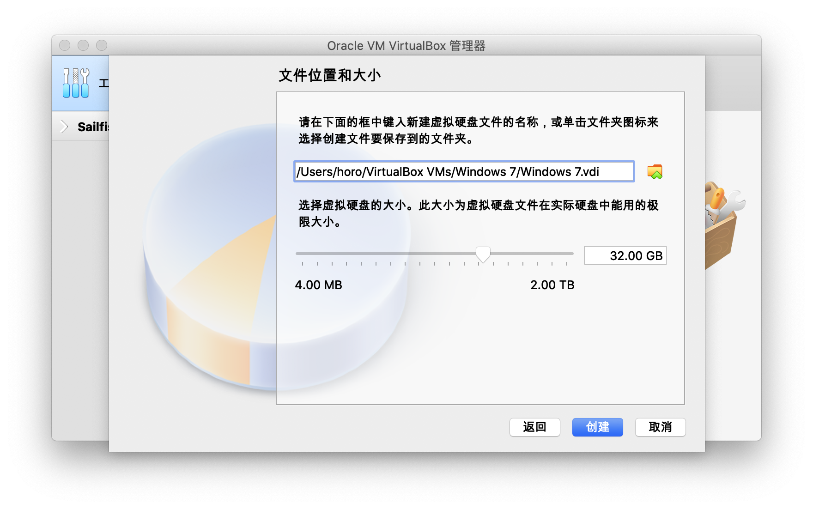

设置虚拟硬盘的位置和大小，虽然能设置的比物理硬盘的实际大小大，实际设置的时候最好不要超过物理硬盘的可用空间。

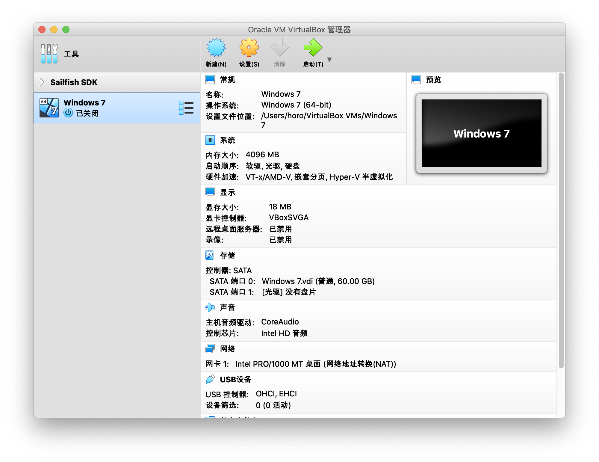

## 额外的设置

点击工具栏上的“设置”按钮打开详细设置。

### 常规

“常规”组中可以设置虚拟机的名称，快照（VirtualBox 里称作”备份）的位置，共享粘贴板和拖放功能（大多数时候需要安装 Guest Additions 以后才能正常工作），编写说明和加密虚拟硬盘。

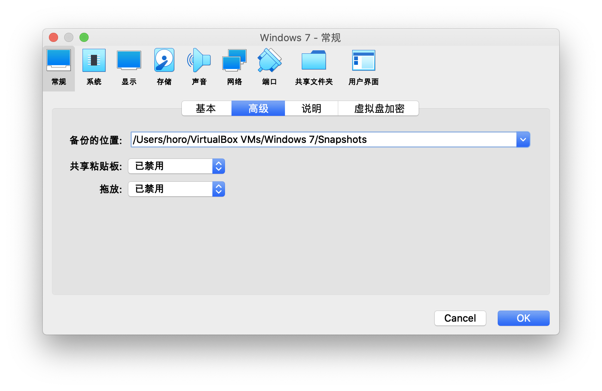

### 系统

“系统”组中可以调整虚拟机的内存大小、CPU数量和其它功能。

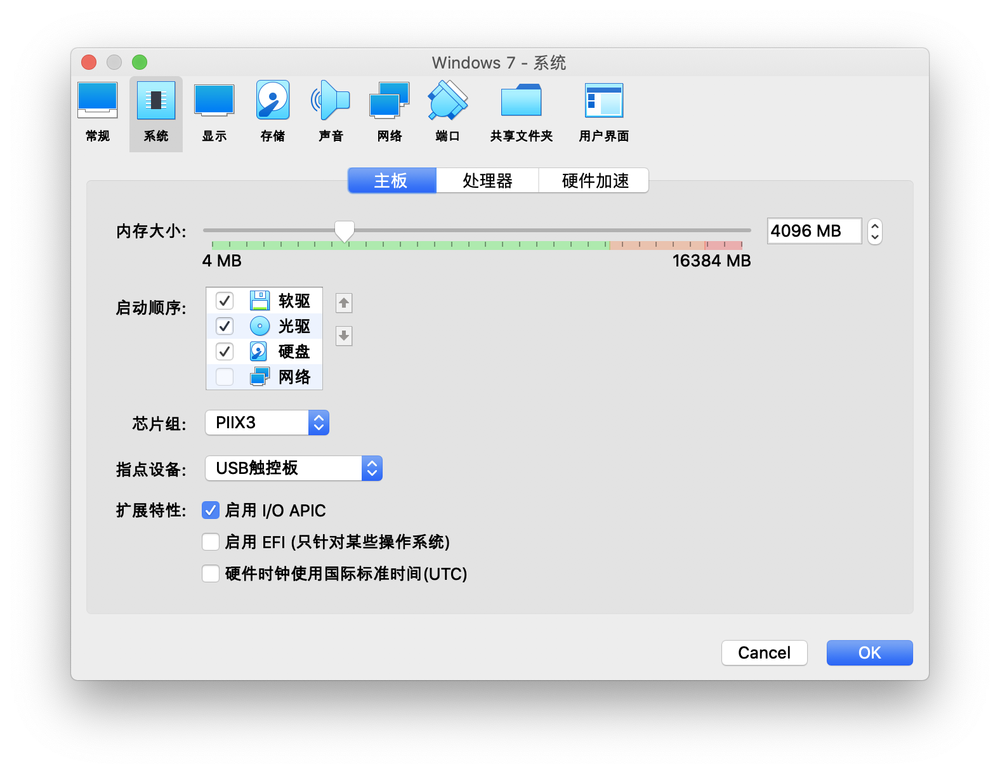

如果汝安装的操作系统支持 EFI 而汝又偏好 EFI 的话，可以把“启用 EFI” 选项打开。

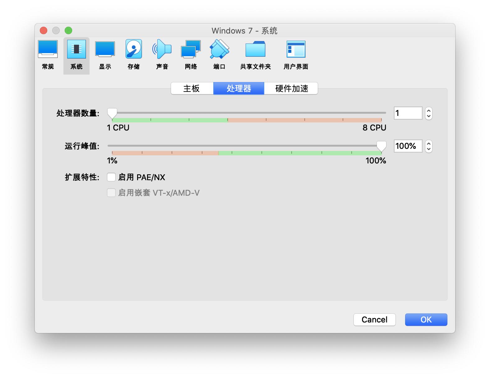

这里的”处理器数量“的最大值是汝主机 CPU 的线程数，不过当汝设置的虚拟处理器数量大于汝主机 CPU 的物理核心数时可能会影响性能。

运行峰值可以设定 Guest OS 使用的 CPU 上限。这个功能可以防止某个 Guest OS 把 CPU 耗尽，导致 Host OS 失去响应，不过设置的太低会显著影响 Guest OS 的性能。

**物理地址扩展**（**Physical Address Extension**，缩写为**PAE**），又释**实体位置延伸**，是[x86](https://zh.wikipedia.org/wiki/X86)处理器的一个功能，让 CPU 在32位操作系统下存取超过 4GB 的 RAM。不过现在基本都是 64 位操作系统了吧……

**NX 位**（全名“**N**o e**X**ecute bit”，即“**禁止执行位**”），是应用在[CPU](https://zh.wikipedia.org/wiki/%E4%B8%AD%E5%A4%AE%E8%99%95%E7%90%86%E5%99%A8)中的一种安全技术。支持 NX 技术的系统会把内存中的区域分类为只供存储处理器指令集与只供存储数据使用的两种。任何标记了 NX 位的区块代表仅供存储数据使用而不是存储处理器的指令集，处理器将不会将此处的数据作为代码执行，以此这种技术可防止多数的缓存溢出式攻击。

基本上现在性能还算堪用的大多数的 CPU 都支持这两项功能，因此可以考虑打开它。

VT-x 和 AMD-V 是 Intel 和 AMD 的半虚拟化技术，如果开启”启用嵌套 VT-x / AMD-V“，汝就能在虚拟机里安装虚拟机软件继续装虚拟机（套娃警告，以及真的有人这么无聊嘛……）

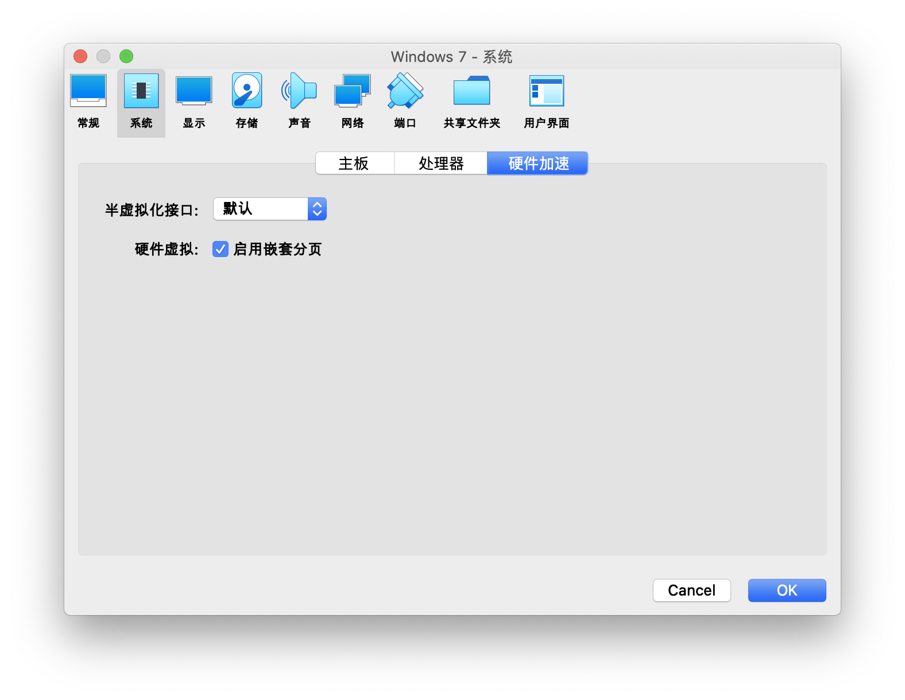

### 显示

可以调整虚拟机的显示内存大小，启用 3D 加速、远程桌面和录制等功能。

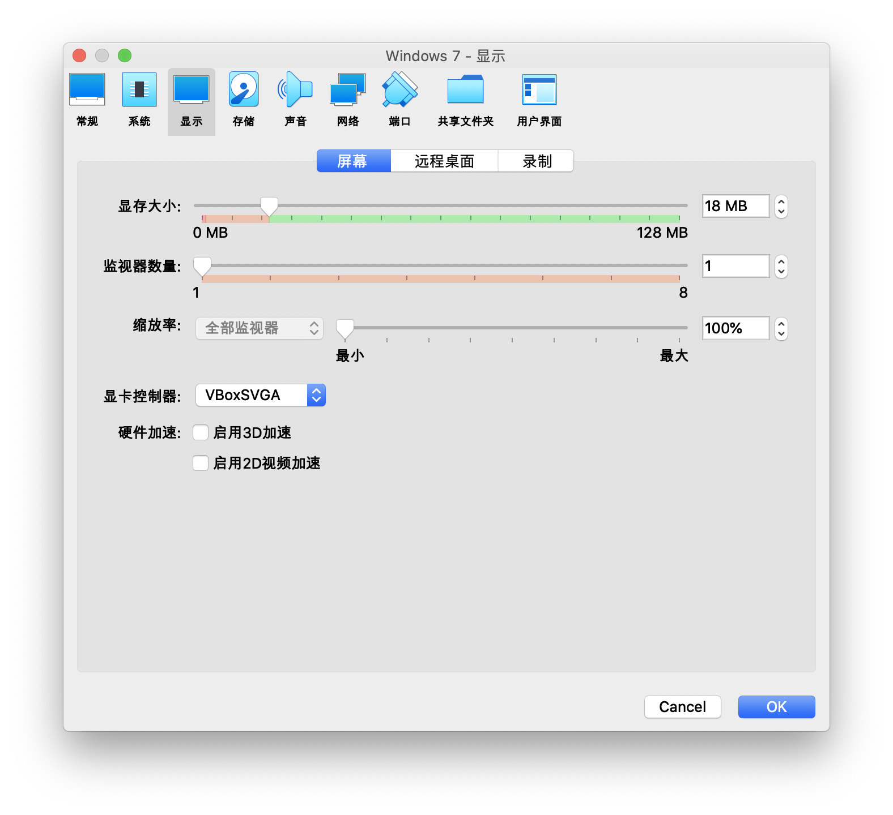

如果汝的电脑有高分屏（啥 2K、4K 等等啦……）但是汝要安装的系统不支持那么高的分辨率的话，可以调整缩放率。（虽然会模糊）

如果汝有在虚拟机里使用 3D 的需求（例如桌面效果或者游戏），可以考虑打开下面的”启用 3D 加速“和”启用 2D 视频加速“这两个选项（有可能需要安装 Guest Additions 以生效）。

> 不过就算打开了，虚拟机的 3D 性能也不会提高到哪里去，有可能还不如 CPU 的核显……

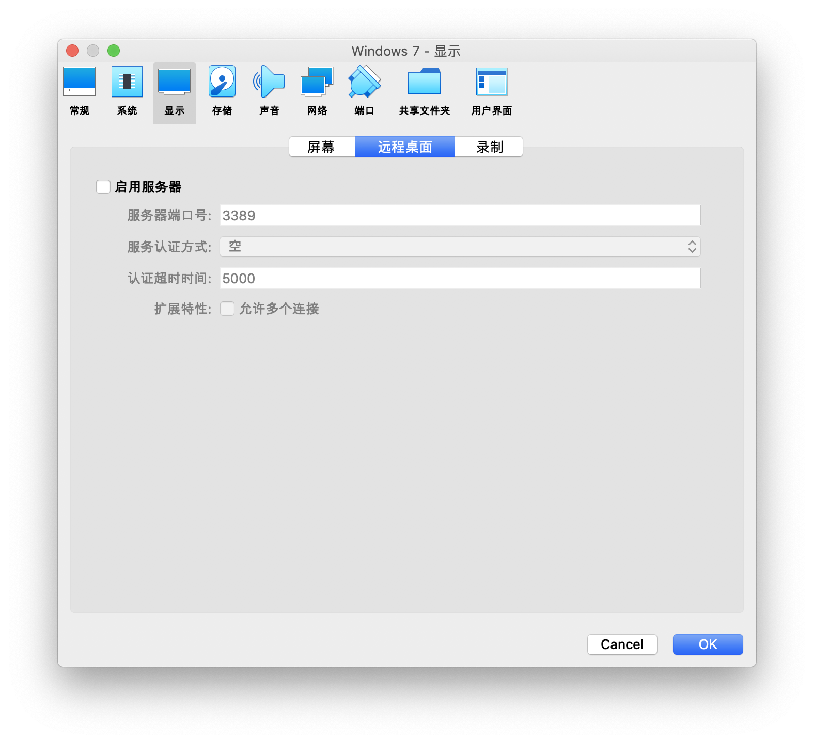

这里的远程桌面是 RDP 协议的，可以使用支持 RDP 协议的客户端来连接。

### 存储

可以增加或删除控制器和虚拟光盘/硬盘/软盘。

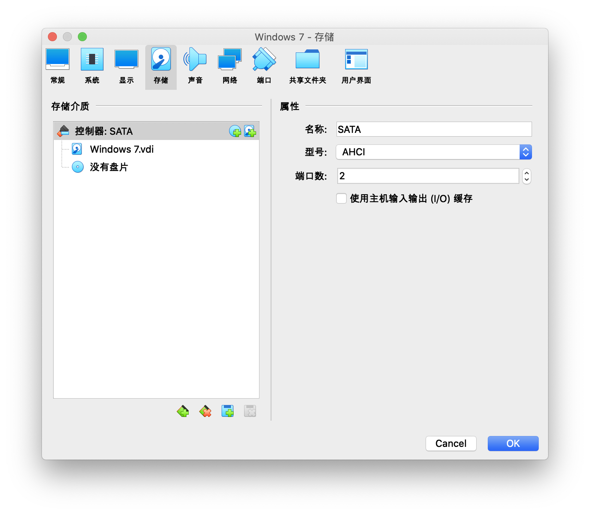

* 可以添加的控制器有软盘/IDE/SATA/SCSI/SAS/USB/NVMe 七种，不同的系统支持的控制器类型可能不同。
* 一个 IDE 控制器最多只能支持 4 个设备。其它的控制器则没有这种限制。
* 启用”使用主机输入/输出缓存”可以稍微提高虚拟硬盘的性能。

### 声音

可以更改声音硬件的相关设置。如果汝在上面选择了正确的系统的话，一开始的默认设置就好了。

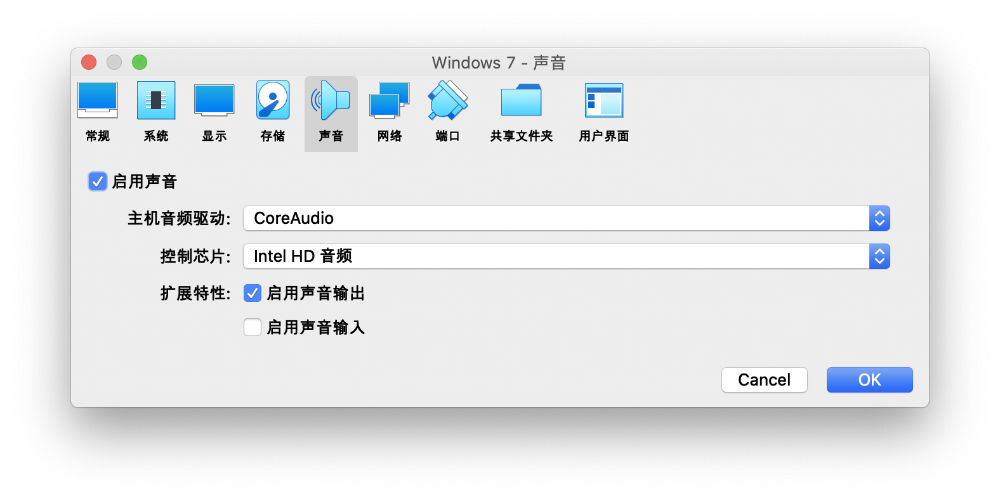

### 网络

可以改变虚拟网卡相关的设置。

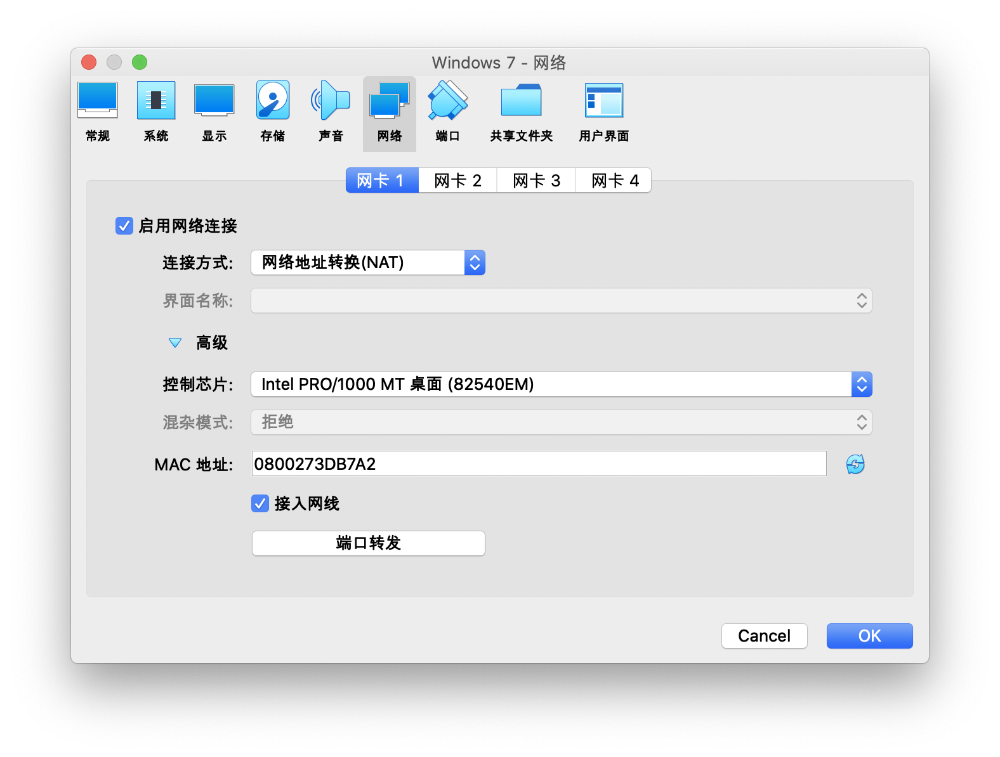

* 目前先不动设置，具体的网卡模式稍后会介绍和使用。
* 那个“接入网线”的开关其实就是虚拟网络是否连接啦。
* 如图所示，最多可以添加四块虚拟网卡。

### 端口

可以更改串口和 USB 设备的设置，目前保持默认就好。

### 共享文件夹

可以设置虚拟机可访问的主机的文件夹，但是要先安装 Guest Additions 才能生效。

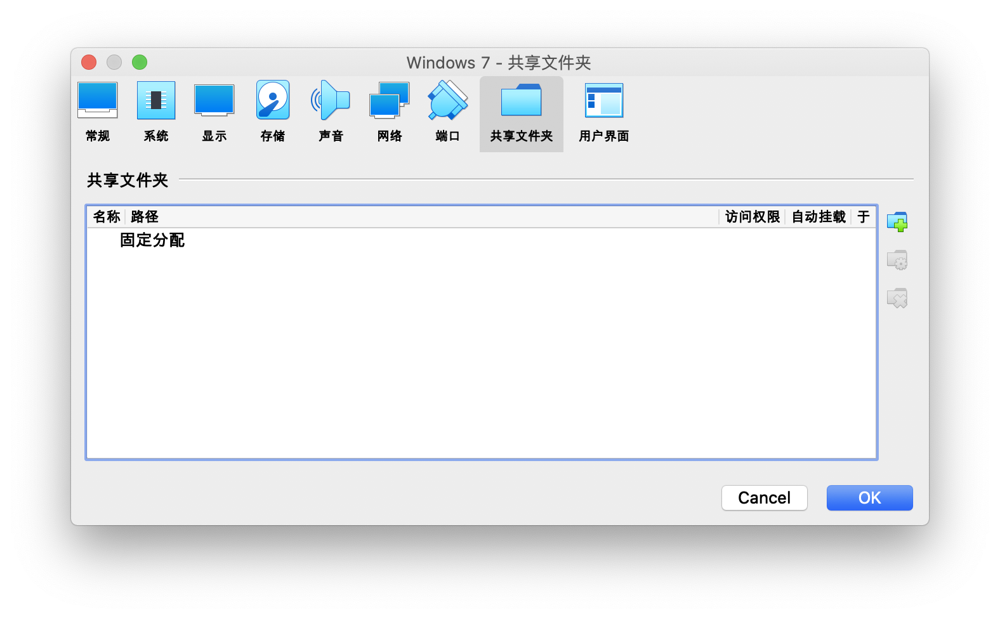

### 用户界面

可以控制菜单栏和状态栏的图标。

完成后按“确认”按钮保存。

## Bonus: 专家模式

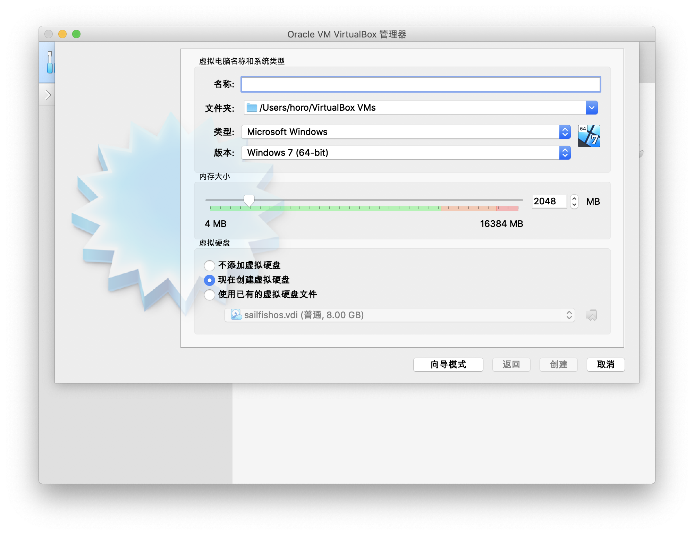

