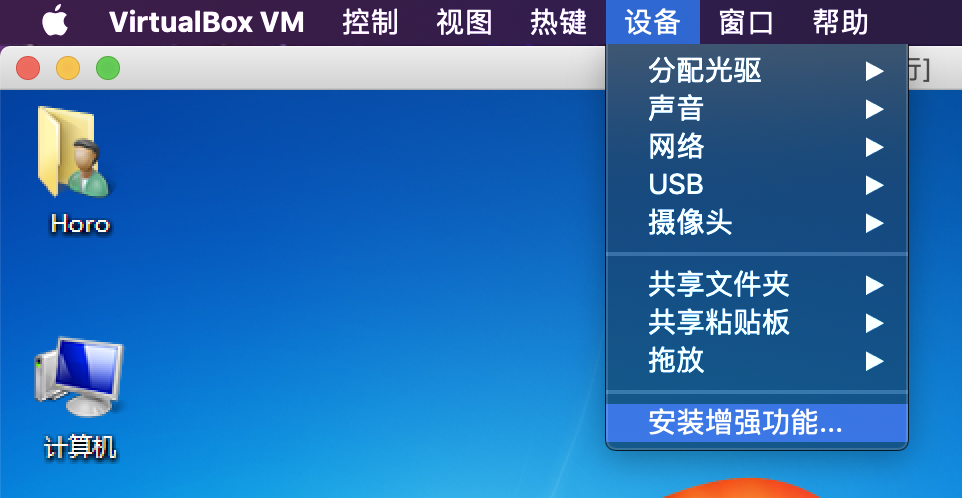
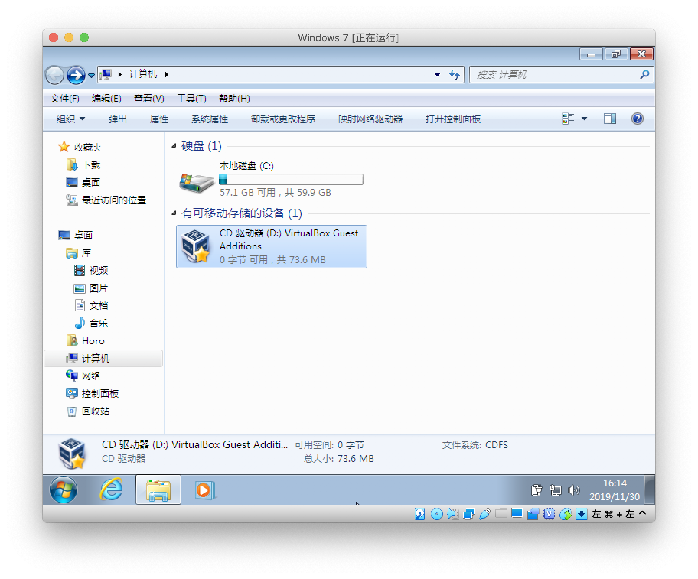
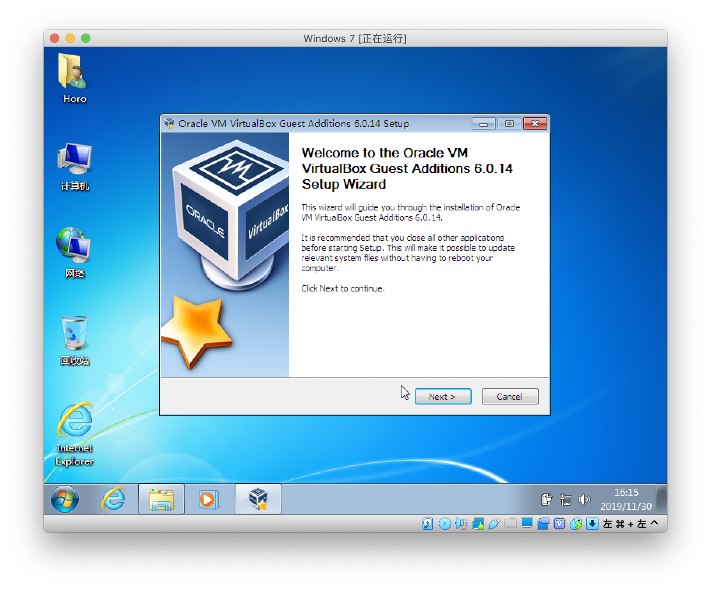
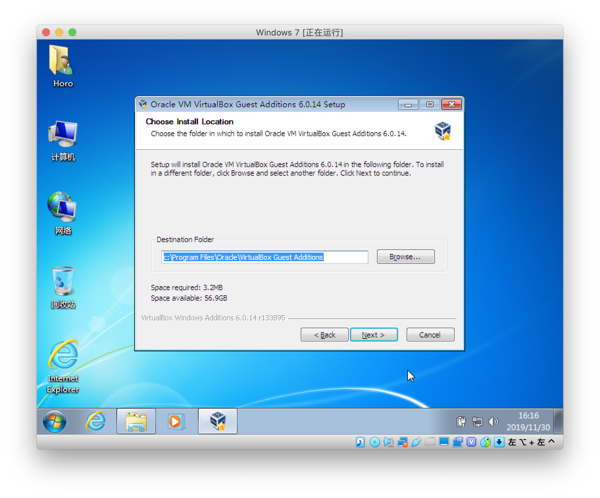
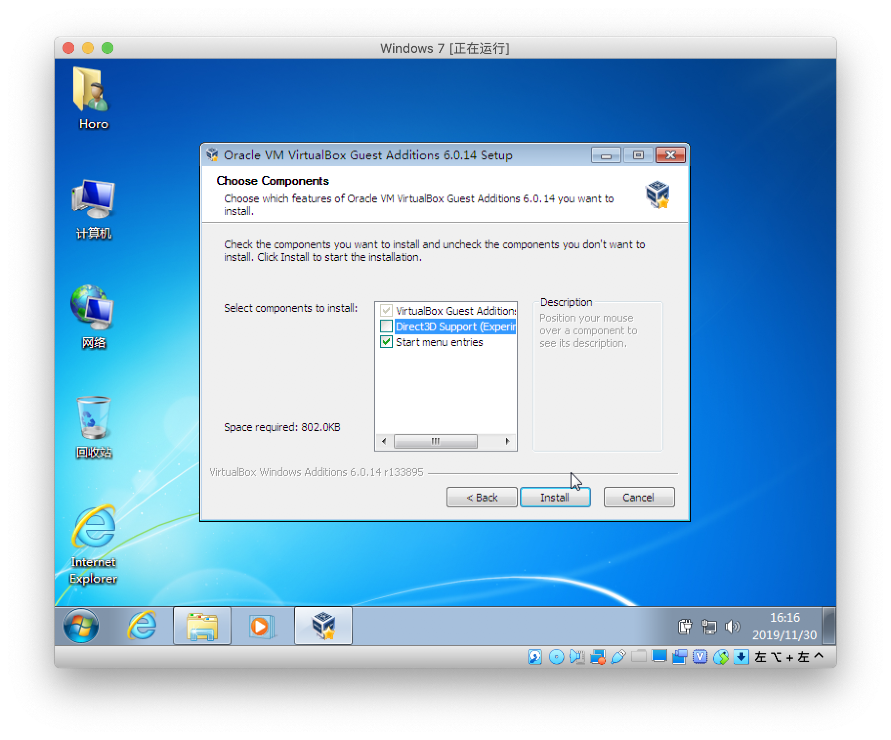
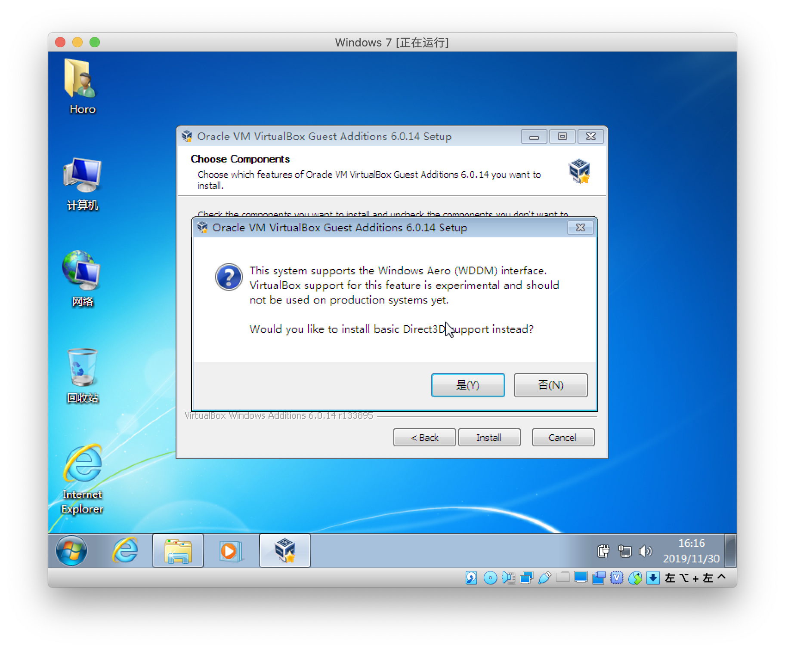
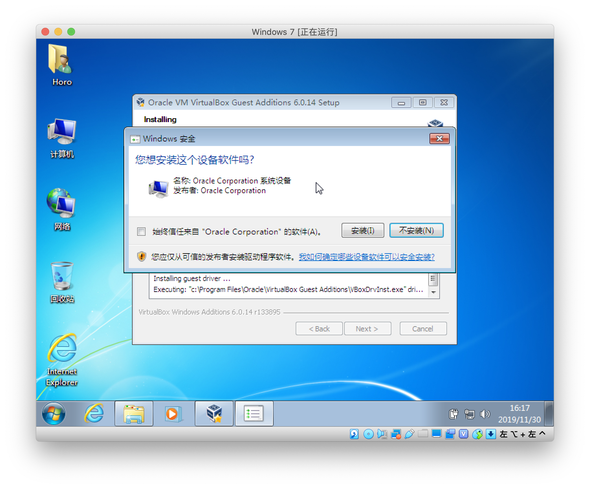
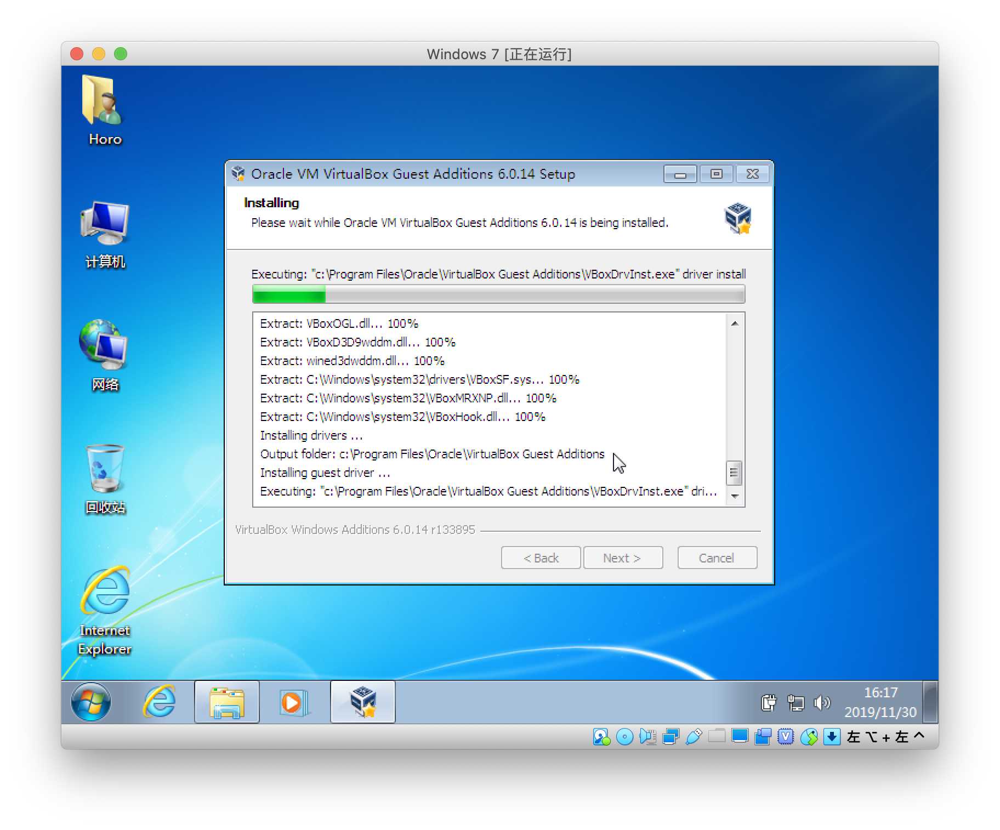
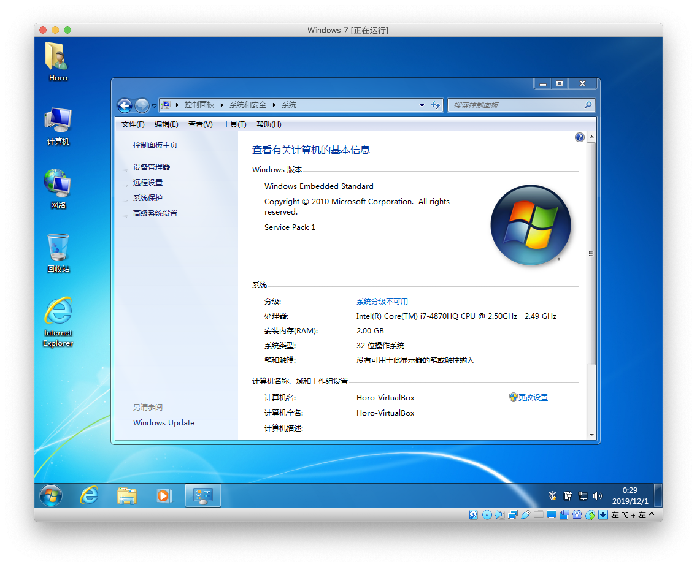

# 在 Windows 虚拟机中安装增强功能

从菜单栏中选择”设备-安装增强功能“，挂载 Guest Additions 的安装 ISO。

如果自动播放选项没打开的话，可以去文件资源管理器里打开虚拟光盘安装。

前几步直接下一步就行……

这里 Direct3D Support 默认没选中（因为还是 Experimental 嘛）

当汝选中的时候，会提示汝是否安装稍微稳定一些的基本 Direct3D 功能。

如果汝选择 No 的话，会提示汝 3D 加速功能需要的显示内存量（至少 128 MB，多个虚拟显示器的话推荐 256 MB），所以别忘了去设置里打开。

选择好后点击下一步安装，如果提示是否允许安装设备软件的话记得允许。

最后就是重启啦，然后增强功能就算装好了。

安装好后大概就是这个样子：

