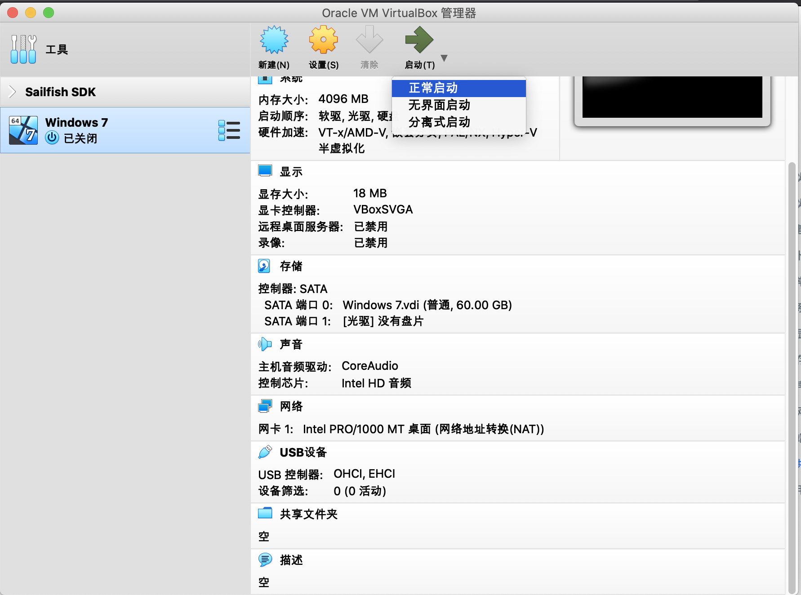
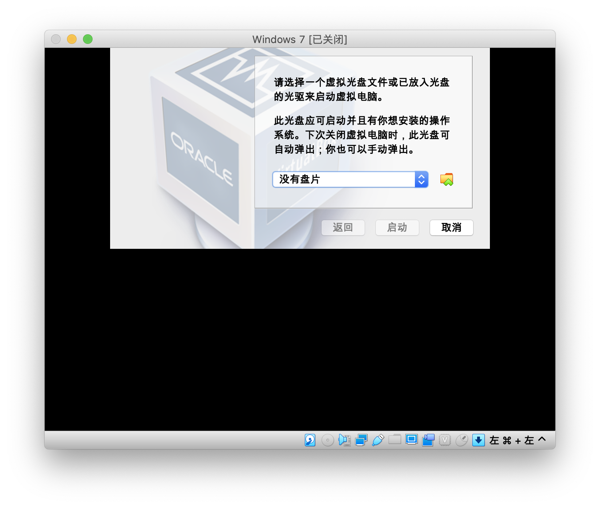
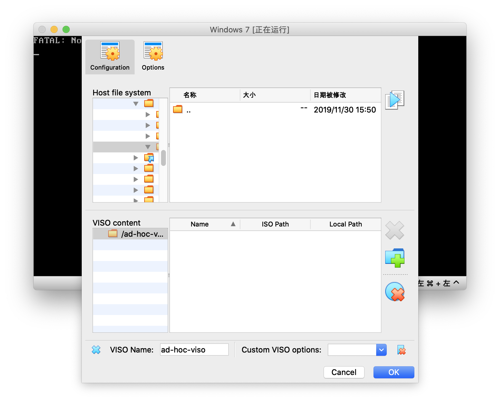
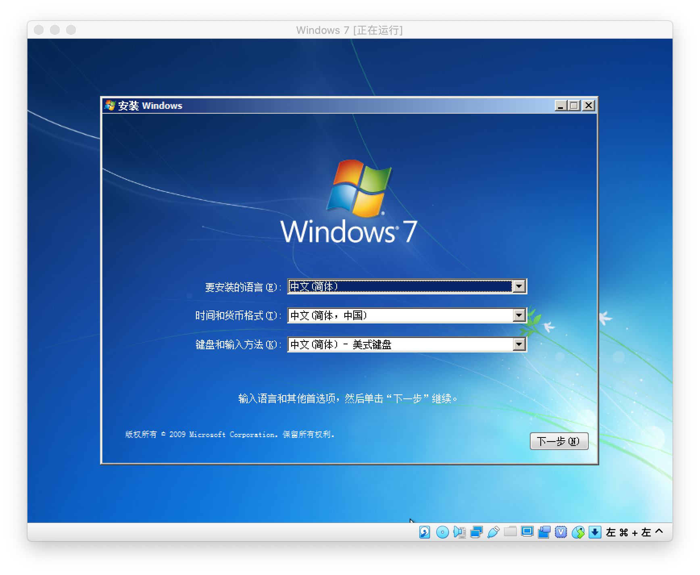

# 为虚拟机安装操作系统

点击菜单栏上的“启动”按钮启动：

那个“无界面启动”就是启动时不显示虚拟显示器咯，“分离式启动“就是虚拟机和管理器为不同的进程，汝可以关掉管理器的窗口而不影响虚拟机的运行。

## 插入虚拟光盘

在第一次启动时，会提示汝插入虚拟光盘安装系统。

按旁边的文件夹按钮选择汝准备好的虚拟光盘文件，通常是 ISO 格式。

如果这个菜单因为各种原因没出现然后汝看到了这个画面的话，可以右键单击状态栏上的光盘图标，选择”选择虚拟盘“来装载虚拟光盘文件。

创建 VISO 功能可以让汝把一些文件放进 VISO 中让虚拟机挂载，在某些时候可能有用。

在启动时按 F12 键，可以临时更改启动设备。

