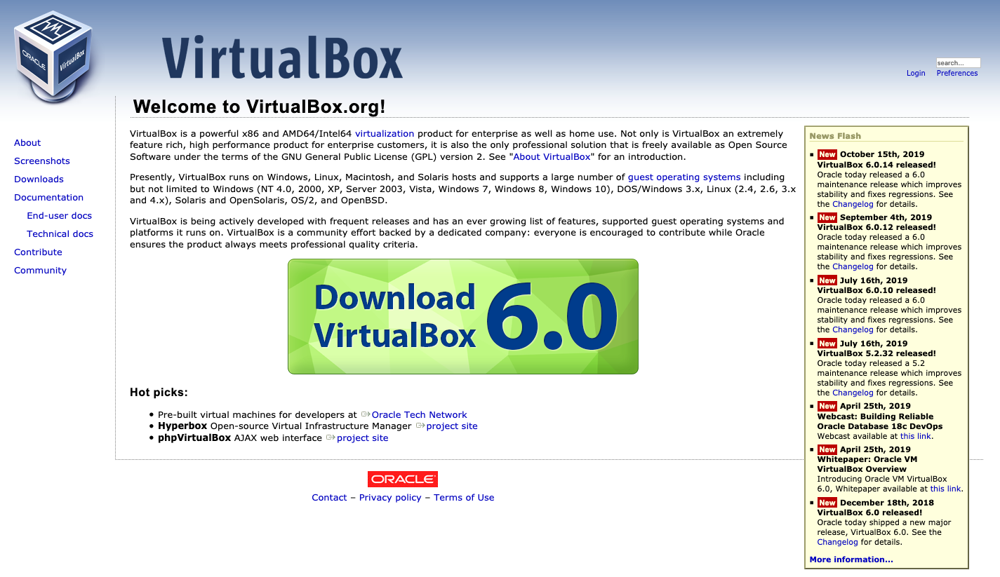
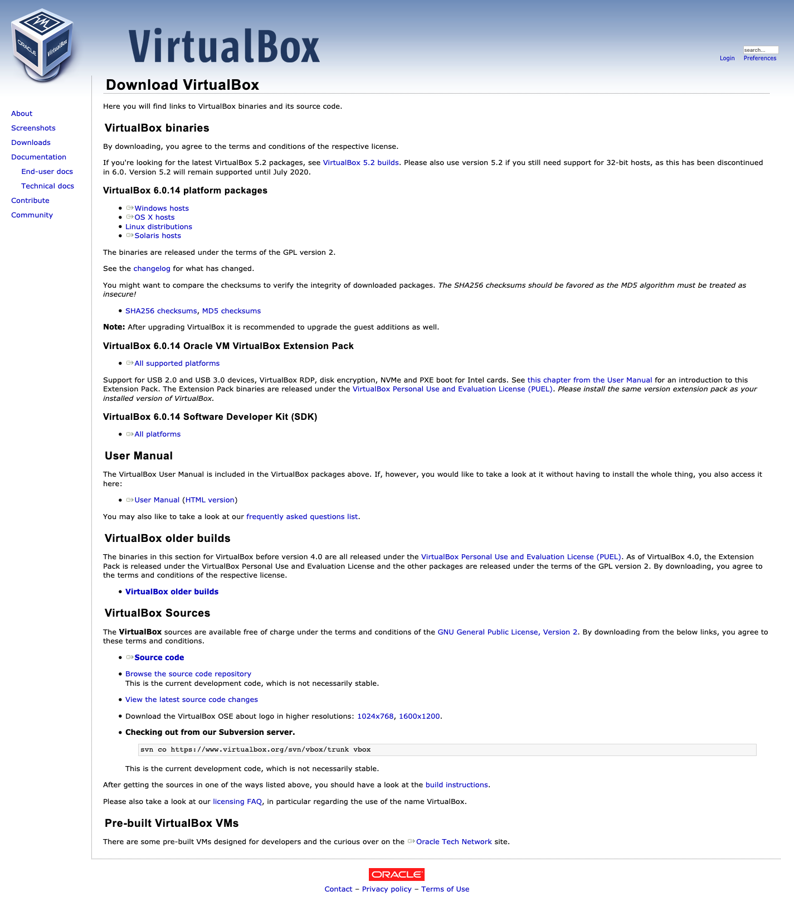
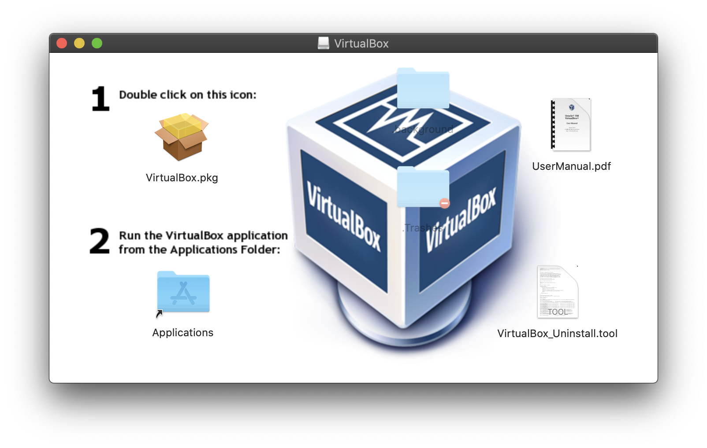
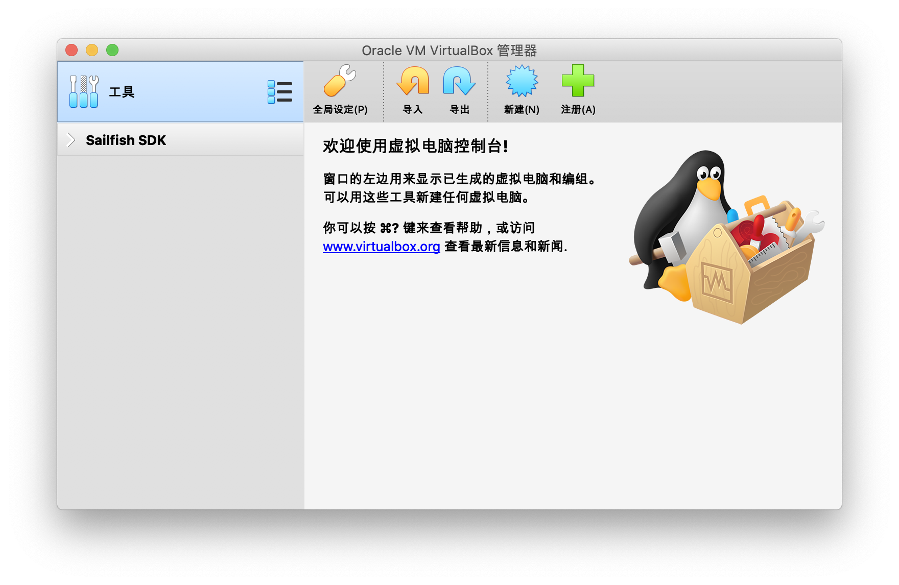
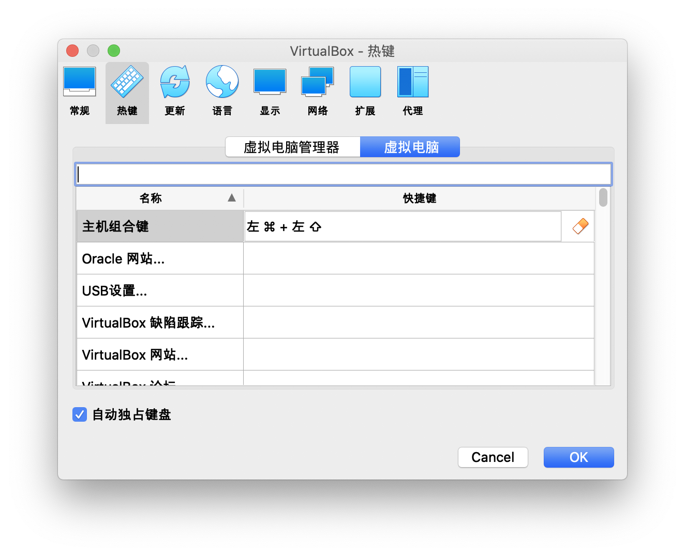

# 下载、安装和设置 VirtualBox

## GNU/Linux：从发行版的仓库安装

如果汝是某个 GNU/Linux 发行版的使用者，那么咱更推荐汝直接从发行版的仓库中安装呐。

用包管理器搜索 “virtualbox” 看看？

## macOS 和 Windows：下载 VirtualBox

首先用汝喜欢的浏览器打开 [https://www.virtualbox.org](https://www.virtualbox.org/) 呗~然后戳中间大大的 Download 按钮。

需要下载的有两个：

* **VirtualBox x.y.z platform packages**，这个是软件的安装包。根据汝主机的系统不同而有区别。
* **VirtualBox x.y.z Oracle VM VirtualBox Extension Pack**，这个是扩展包，提供 USB2.0/3.0 支持等一系列功能。

Windows 的话双击下载来的安装包来安装。

macOS 的话双击下载来的磁盘映像挂载它，然后运行里面的安装器应用。

## 安装 VirtualBox 扩展包

安装完成以后双击扩展包安装它，注意那个许可协议要拉到最后才能选择同意或拒绝。

## 简单设置

如果需要的话，点击工具栏上的“全局设定”来打开全局设定。

